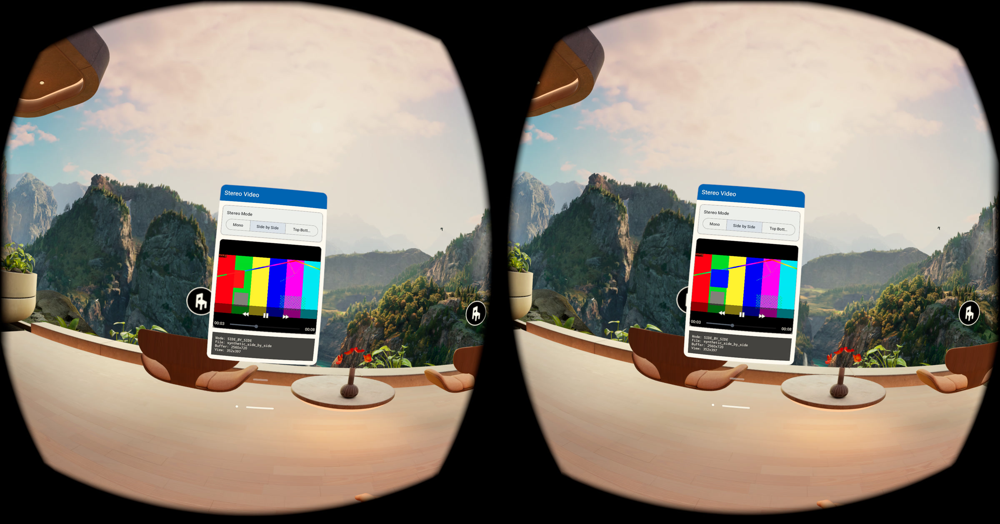

<!--
  Copyright (c) Meta Platforms, Inc. and affiliates.

  This source code is licensed under the MIT license found in the
  LICENSE file in the root directory of this source tree.
-->

# Stereo Video Sample

This sample demonstrates how an Android app can present stereo video content in
a 2D panel on Meta Quest by using APIs from the [Horizon OS Java Software
Development Kit (JSDK)](https://developers.meta.com/horizon/documentation/android-apps/horizon-os-jsdk).

The app includes two implementations:

- [`StereoVideoActivity`](app/src/main/java/horizonos/os/sdk/sample/stereovideo/StereoVideoActivity.kt)
  uses Android [`VideoView`](https://developer.android.com/reference/android/widget/VideoView).
- [`StereoSurfaceViewActivity`](app/src/main/java/horizonos/os/sdk/sample/stereovideo/StereoSurfaceViewActivity.kt)
  uses Android [`SurfaceView`](https://developer.android.com/reference/android/view/SurfaceView)
  and [`MediaPlayer`](https://developer.android.com/reference/android/media/MediaPlayer).

Both activities let you switch between mono, side-by-side, and top-bottom video
layouts.

The bundled videos are synthetic test patterns generated with `ffmpeg` for this
sample.

## Key files

| File | Description |
| ---- | ----------- |
| [`StereoVideoActivity.kt`](app/src/main/java/horizonos/os/sdk/sample/stereovideo/StereoVideoActivity.kt) | Demonstrates the minimal `VideoView` path for applying stereo composition to Android video playback. |
| [`StereoSurfaceViewActivity.kt`](app/src/main/java/horizonos/os/sdk/sample/stereovideo/StereoSurfaceViewActivity.kt) | Demonstrates the lower-level `SurfaceView` and `MediaPlayer` path, including per-eye aspect ratio sizing. |
| [`StereoVideoResources.kt`](app/src/main/java/horizonos/os/sdk/sample/stereovideo/StereoVideoResources.kt) | Maps each sample video resource to the matching stereo composition mode. |
| [`app/build.gradle.kts`](app/build.gradle.kts) | Declares the Android application and Horizon OS JSDK dependency. |

## What this shows

- Calling [`SurfaceViewExt.setStereoComposition()`](https://developers.meta.com/horizon/reference/horizon-os-jsdk/latest/classhorizonos_os_surfaceviewext)
  on a `SurfaceView` or `VideoView`.
- Using [`SurfaceControlExt.STEREO_COMPOSITION_MONO`](https://developers.meta.com/horizon/reference/horizon-os-jsdk/latest/classhorizonos_os_surfacecontrolext), [`SurfaceControlExt.STEREO_COMPOSITION_SIDE_BY_SIDE`](https://developers.meta.com/horizon/reference/horizon-os-jsdk/latest/classhorizonos_os_surfacecontrolext), and [`SurfaceControlExt.STEREO_COMPOSITION_TOP_BOTTOM`](https://developers.meta.com/horizon/reference/horizon-os-jsdk/latest/classhorizonos_os_surfacecontrolext) to set the rendering mode.
- Matching the displayed aspect ratio to the per-eye content size when a video
  file stores stereo frames in a packed buffer.

## Prerequisites

- Android Studio or the Gradle command line.
- A physical Meta Quest device running Horizon OS v204 or later.
- Horizon OS JSDK version 204 or later. This sample declares the dependency as
  `com.meta.horizonos:horizon-os-jsdk` through the Gradle version catalog.

## Building

```bash
./gradlew assembleDebug
```

The APK is generated at:

```text
app/build/outputs/apk/debug/app-debug.apk
```

## Installing and running

```bash
adb install -r app/build/outputs/apk/debug/app-debug.apk
adb shell am start -n horizonos.os.sdk.sample.stereovideo/.StereoVideoActivity
```

To launch the `SurfaceView` version directly:

```bash
adb shell am start -n horizonos.os.sdk.sample.stereovideo/.StereoSurfaceViewActivity
```

You can also launch either activity from the **Unknown Sources** section of the
Library.

## Usage

Use the mode buttons at the top of the sample:

- **Mono** plays a standard mono video.
- **Side by Side** plays a video where the left eye image is stored in the left
  half of each frame and the right eye image is stored in the right half.
- **Top Bottom** plays a video where the left eye image is stored in the top
  half of each frame and the right eye image is stored in the bottom half.

The composition info at the bottom of the app shows the selected mode, video
file, encoded buffer size, and current view size.

To use your own video, replace the sample files in `app/src/main/res/raw/` and
update `StereoVideoResources.kt` to point each mode at the matching resource.
Use mono mode for normal video, side-by-side mode for side-by-side packed video,
and top-bottom mode for top-bottom packed video.

## Composition modes

### Mono composition mode

`SurfaceControlExt.STEREO_COMPOSITION_MONO` uses standard single-view
composition. The same buffer content is shown to both eyes.

### Side by Side composition mode

`SurfaceControlExt.STEREO_COMPOSITION_SIDE_BY_SIDE` treats each frame as two
horizontal regions:

- The left half contains the left eye image.
- The right half contains the right eye image.

For example, a 2460 x 704 side-by-side video contains two 1230 x 704 eye images
packed into one frame.

### Top Bottom composition mode

`SurfaceControlExt.STEREO_COMPOSITION_TOP_BOTTOM` treats each frame as two
vertical regions:

- The top half contains the left eye image.
- The bottom half contains the right eye image.

For example, a 960 x 2160 top-bottom video contains two 960 x 1080 eye images
packed into one frame.

## Buffer size versus display size

Packed stereo video files usually have a different encoded buffer size than the
per-eye image size that should determine the displayed aspect ratio.

For side-by-side content:

```text
displayWidth = encodedBufferWidth / 2
displayHeight = encodedBufferHeight
```

For top-bottom content:

```text
displayWidth = encodedBufferWidth
displayHeight = encodedBufferHeight / 2
```

The `SurfaceView` Activity in this sample computes those per-eye dimensions
after `MediaPlayer` reports the encoded video size. It then resizes the view so
the panel has the correct aspect ratio for the image each eye receives.

The `VideoView` Activity leaves sizing to the standard `VideoView` behavior and
focuses on the smallest call pattern for applying stereo composition to an
existing Android video component.

## Applying stereo composition

Set the composition mode before or when presenting content on the surface:

```kotlin
SurfaceViewExt.setStereoComposition(
    surfaceView,
    SurfaceControlExt.STEREO_COMPOSITION_SIDE_BY_SIDE,
)
```

Switch back to mono with:

```kotlin
SurfaceViewExt.setStereoComposition(
    surfaceView,
    SurfaceControlExt.STEREO_COMPOSITION_MONO,
)
```

The app is responsible for providing content in the layout that matches the
selected composition mode. Setting side-by-side mode does not convert a mono
video into stereo. Rather, it tells Horizon OS how to route regions of the
app-provided buffer to each eye.

## Validation

After installing and running the sample on a Quest device, it will look similar
to the following screenshot:



The stereo depth effect is intended to be viewed in a headset. Screenshots can
show the packed video content and sample UI, but they do not fully represent the
binocular depth effect seen by the wearer.

## Project structure

```text
StereoVideoSample/
├── README.md
├── gradle/
│   └── libs.versions.toml
├── settings.gradle.kts
├── app/
│   ├── build.gradle.kts
│   └── src/main/
│       ├── AndroidManifest.xml
│       ├── java/horizonos/os/sdk/sample/stereovideo/
│       │   ├── StereoVideoActivity.kt
│       │   └── StereoSurfaceViewActivity.kt
│       └── res/
│           ├── layout/
│           └── raw/
└── gradlew
```

## Key APIs used

| API | Purpose |
| --- | --- |
| [`SurfaceViewExt.setStereoComposition()`](https://developers.meta.com/horizon/reference/horizon-os-jsdk/latest/classhorizonos_os_surfaceviewext) | Sets the stereo composition mode for a `SurfaceView` or `VideoView`. |
| [`SurfaceControlExt.STEREO_COMPOSITION_MONO`](https://developers.meta.com/horizon/reference/horizon-os-jsdk/latest/classhorizonos_os_surfacecontrolext) | Uses standard mono composition. |
| [`SurfaceControlExt.STEREO_COMPOSITION_SIDE_BY_SIDE`](https://developers.meta.com/horizon/reference/horizon-os-jsdk/latest/classhorizonos_os_surfacecontrolext) | Maps the left and right halves of the buffer to the left and right eyes. |
| [`SurfaceControlExt.STEREO_COMPOSITION_TOP_BOTTOM`](https://developers.meta.com/horizon/reference/horizon-os-jsdk/latest/classhorizonos_os_surfacecontrolext) | Maps the top and bottom halves of the buffer to the left and right eyes. |

---

_Java is a registered trademark of Oracle and/or its affiliates._
